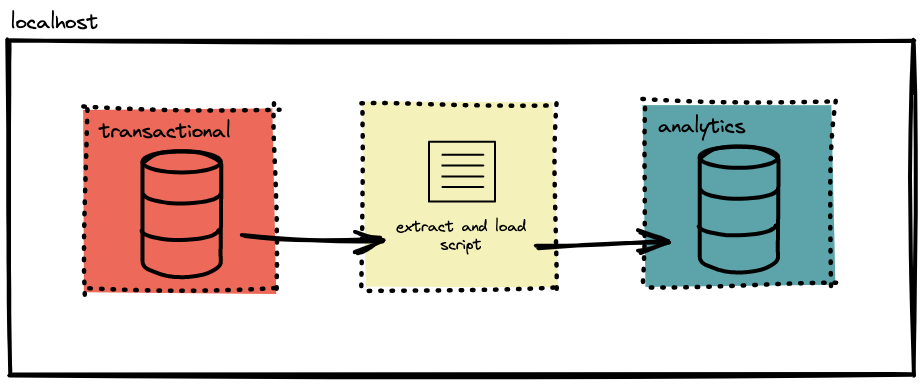

# Desafio de Engenharia de Dados da Refera

Este repositório tem como finalidade apresentar os códigos desenvolvidos para solucionar o desafio de Engenharia de Dados da Refera.

Este projeto foi construído considerando os seguintes pontos:

1. Considerando que cada container deve ser isolado para assumir uma única responsabilidade, foi criado um terceiro container para executar o script desenvolvido. Este container foi construído sobre a imagem do Ubuntu com a finalidade de permitir a instalação dos pacotes necessários.

2. O script desenvolvido consiste em aproveitar as portas expostas previamente definidas no docker-compose.yml original do desafio. Desta forma é possível utilizar comandos da linha de comando para acessar os bancos de dados para extração e carregamento. Optou-se pela simplicidade da CLI uma vez que a tarefa em questão não exige maior complexidade para sua resolução.

3. Considerou-se que assim que os contêineres estivessem disponíveis a operação deveria ser feita sem interferência externa (processo automatizado).

## O desafio

Pensando em não sobrecarregar nosso banco de dados transacional, precisamos ter um ambiente separado para analisar nossos dados sem grandes problemas. Assim, escreva um código local que faça uma extração total de todas as tabelas do banco de dados `transactional` e as carregue para o banco de dados `analytics`.

O arquivo [docker-compose.yml](docker-compose.yml) ativa containers com os bancos de dados `transactional` e `analytics`.



Diferenciais na implementação:
- script rodando dentro do docker

## Execução

Para executar a solução proposta basta rodar:

```bash
docker-compose up
```

Como a extração e carregamento é feito de forma automática, pode-se verificar o funcionamento ao acessar o container de analytics:

```bash
docker exec -it refera-challenge-analytics-1 sh
```

Dentro da linha de comando do container acessamos o banco de dados:

```bash
psql -U postgres
```

Por fim verificamos a presença de dados populados nas tabelas, neste caso usamos a tabela actor como exemplo:

```bash
\c analytics
SELECT * FROM actor;
```
